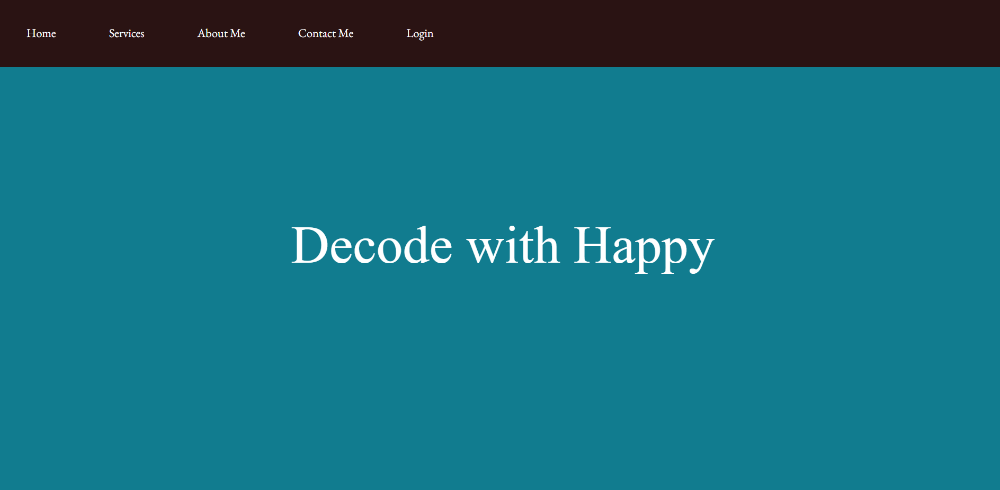

# DecodewithHappy

My personal blog built using HTML,CSS and JS. 

## Introduction - the project's aim

It includes several tech related article, the main section is divided into 2 columns in the lefthand side the name of the topics are present and on righthand side topics description is given. If we click on the lefthand side on a topic then its description will appear on the righthand side.
## Technologies

1.HTML5

2.CSS3

3.Javascript

## Screenshots

